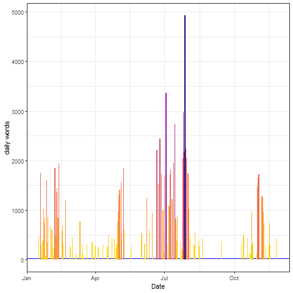

# Creative Writing Stats in R
This little summary started as a way to use Chris Fox's [5000 words per hour](https://www.chrisfoxwrites.com/write-faster-write-smarter/). The idea is to do writing sprints. Set yourself a timer and just write. At the end of the sprint, count the words and the R script gives me metrics. 

I do this in R for three reasons: 
1. ggplot is a really pretty visualisation tool 
2. I can do something similar to the NaNoWriMo website with the two advantages that I can add word counts in retrospective and edit my wordcounts offline. 
3. It has actually helps me with my research since I still have to use R. Some of the lines here were actually repurposed for my master thesis. That being said, I'm hoping to also have a Python version soon. 

I'm always open to any suggestions, so let me know on [twitter](https://twitter.com/quantumlandbook), if you have any ideas for improving the code. 

